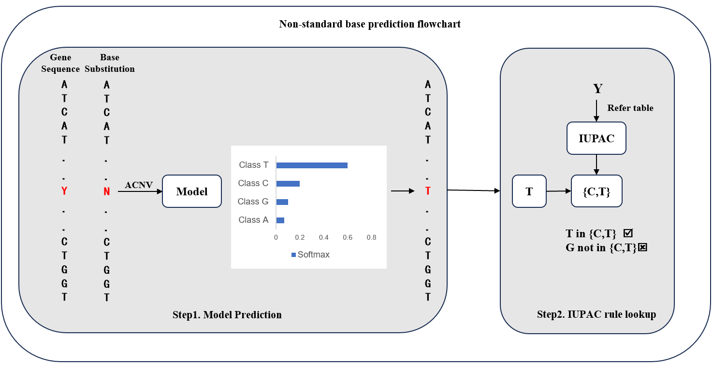

```markdown
# ACNVMaskRecover

ACNVMaskRecover is a Python tool designed to recover masked regions information in genomic sequences.

## Project Structure

/ACNVMaskRecover
├── /acnv/
│   ├── Predict_Step1_pull_masked_seq.py
│   ├── Predict_Step2_Create_NV.py
│   ├── Predict_Step3_predicting_plus.py
│   ├── Predict_Step4_show_result.py
│   ├── Predict_Step5_validate.py
│   ├── Step1_filter_ACGT.py
│   ├── Step2_split_seq.py
│   ├── Step2_split_seq_new.py
│   ├── Step3_remove_duplicate.py
│   ├── Step4_mask_seq_create_NV.py
│   └── Step5_LSTM_training.py
├── figs/maskrecover.png
├── README.md
└── LICENSE
```


## Architecture Diagram

Below is the architecture diagram of the project:



## Project Overview

This project aims to address issues of missing or ambiguous bases in genomic sequences caused by sequencing errors, repetitive regions, and complex biological processes. The main features include:

1. **Genomic Sequence Encoding**: Uses an Asymmetric Covariance Natural Vector (ACNV)-based method to encode genomic sequences, enabling more effective utilization of information surrounding missing bases for prediction.

2. **Ambiguous Base Prediction**: Utilizes a Gated Recurrent Unit (GRU) model to predict ambiguous bases (such as R, Y, S, W, K, etc.) in genomic sequences.

3. **Improved Prediction Accuracy**: Compared to traditional encoding methods (e.g., One-hot encoding), the ACNV method shows significant advantages in recovering missing bases in intermediate positions.

4. **SARS-CoV-2 Variant Data Analysis**: The method also performs well on the SARS-CoV-2 Alpha variant dataset, with an error rate of just 1.09% in predicting non-standard bases.

This project effectively recovers missing bases in genomic sequences, improves the accuracy of genomic data analysis, and has broad potential for practical applications.

## Data Source

The data used in this project is sourced from the [GISAID database](https://www.gisaid.org). We downloaded relevant FASTA and metadata files from the EPICOV interface on the GISAID platform and performed data extraction.

## Installation and Usage

1. Clone the repository:

   ```bash
   git clone https://github.com/karlieswift/ACNVMaskRecover.git
   ```

2. Navigate to the project directory:

   ```bash
   cd ACNVMaskRecover
   ```

3. Execute the scripts in the order listed in the project:

   ```bash
   python acnv/Predict_Step1_pull_masked_seq.py
   python acnv/Predict_Step2_Create_NV.py
   python acnv/Predict_Step3_predicting_plus.py
   python acnv/Predict_Step4_show_result.py
   python acnv/Predict_Step5_validate.py
   ``` 
```
